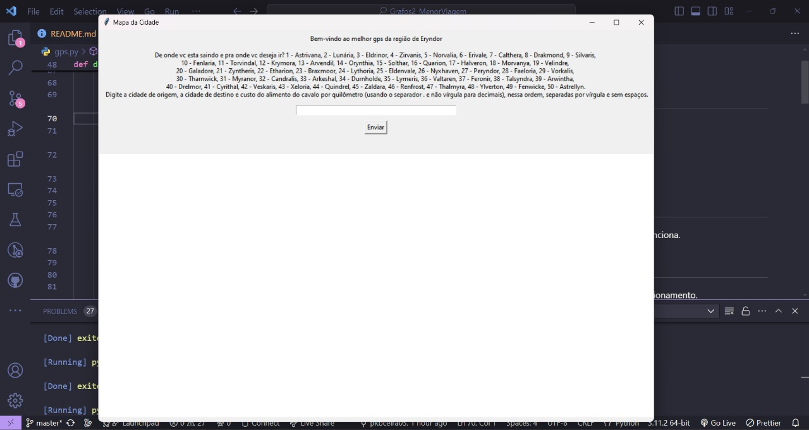
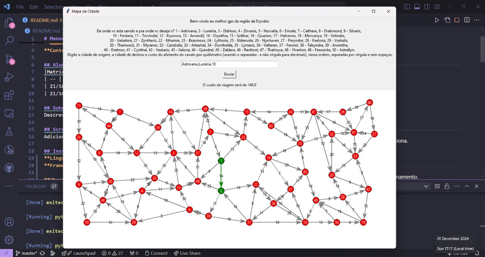
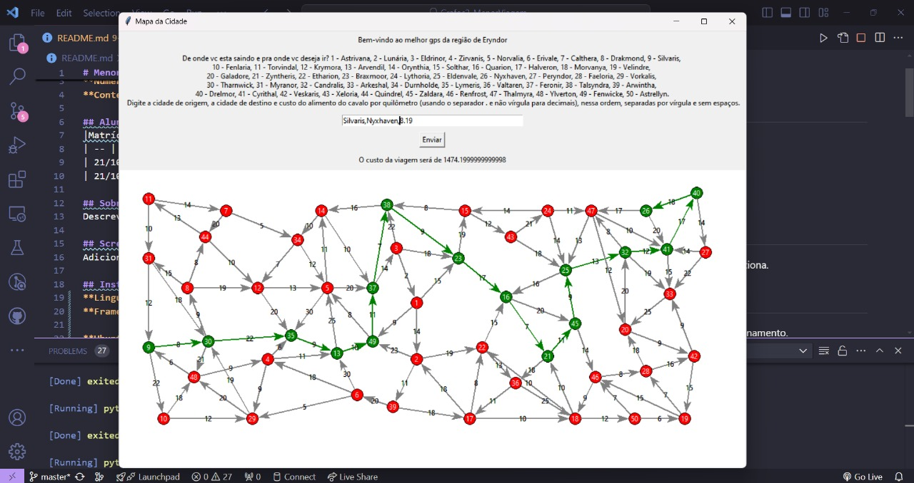

# Menor Viagem

**Número da Lista**: 2<br>
**Conteúdo da Disciplina**: Grafos 2<br>

## Alunos
|Matrícula | Aluno |
| -- | -- |
| 21/1029156  |  Brunna Louise Martins Rocha |
| 21/1043727  |  Pedro Cabeceira de Freitas |

## Sobre 
Este programa foi desenvolvido como parte de um trabalho da disciplina de Projeto de Algoritmos e tem como objetivo calcular a menor distância entre duas cidades e o custo dessa viagem. O programa se baseia no algoritmo de Dijkstra de cálculo de menores "custos" entre nós de um grafo, e no escopo desse trabalho, o custo se traduz na distância (em quilômetros) entre duas cidades (os nós no grafo). Ele permite que o usuário insira sua cidade de origem, sua cidade de destino e o custo do alimento do cavalo por quilômetro (pois se passa em um ambiente medieval). O algoritmo calcula e mostra no mapa o menor caminho entre as duas cidades e apresenta o custo total da viagem. Dessa forma, o programa busca otimizar a jornada do viajante medieval, reduzindo o tempo e o custo da viagem realizada.

## Screenshots




## Instalação 
**Linguagem**: Python<br>
**Framework**: n/a<br>

**Ubuntu**:

Para rodar, é preciso ter instalado o Python 3.

```
$ sudo apt-get update
$ sudo apt-get install python3.6
```

Depois, para instalar a biblioteca [tkinter](https://docs.python.org/pt-br/3/library/tkinter.html#module-tkinter):
```
sudo apt-get install python-tk
```


## Uso 
No Visual Code Studio, selecione o arquivo gps.py e aperte o botão Run Code. Aparecerá um pop-up na tela com a interface do programa.
Digite sua cidade de origem, a cidade de destino e o quanto custa o alimento de seu cavalo por quilômetro andado. Aperte enviar e o mapa da região aparecerá na tela e terá dois tipos de nós: nós verdes significam cidades pelas quais você terá de passar para chegar a seu destino; e nós vermelhos não fazem parte da sua jornada até a cidade de destino. Também haverá dois tipos de arestas: arestas verdes significam caminhos pelos quais você terá de percorrer para chegar ao seu destino; e arestas cinzas não fazem parte do seu caminho.
Para sair do programa, basta apertar o x no canto superior direito da interface.


## Restrições do Programa
A entrada deve seguir um padrão específico: origem,destino,consumo. Exemplo: Astrivana,Lunária,10

Precisa-se necessariamente de duas cidades, uma de origem e uma de destino, e logo depois um número (que pode ter casas decimais, sendo elas separadas por ponto . e não por vírgula ,). Não pode haver espaços entre as vírgulas. 

## Apresentação

Clique na thumbnail abaixo para acessar o vídeo no YouTube.

[](https://www.youtube.com/watch?v=XkiqGTQ2kwY)


